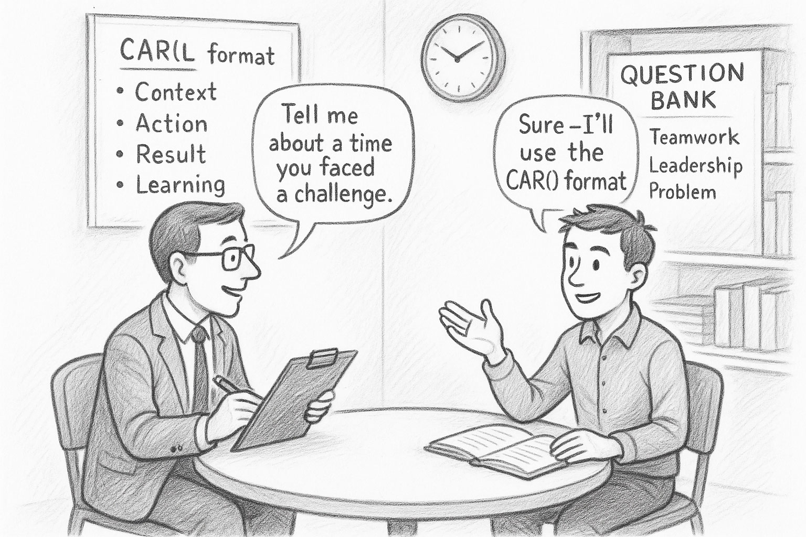

# A Short Guide for Building a Behavioral Interview Question Bank (resume-based)

> "I practice as if it was in the game. So when the moment comes in the game it is nothing new to me. That's the beauty of the game of basketball. That's the reason why you practice." — Michael Jordan

# Introduction

This is a ****guide for building a behavioral interview question bank**** tailored towards individual contributor roles such as software engineers. This guide explains step by step what you need to do to decode interview questions and how to create good answers based on the values of the company you are applying to and the roles and projects you put on your resume.

****The Core Insight:**** You don't need 130+ unique answers. You need 8-10 well-crafted stories from your career that can be adapted to answer most behavioral questions. This is the ****Story Bank Strategy****, and it's far more effective than attempting to memorize individual responses to every possible question.

# Overview

This guide is organized around a story-first approach to interview preparation:

1. ****Understanding What's Being Tested**** – Learn the 9 competency clusters that behavioral questions assess, so you know what signals interviewers are looking for.

2. ****Structuring Your Stories**** – Master the STAR and CARL frameworks for delivering technically-deep, impact-driven responses.

3. ****The Story Bank Strategy**** – Build 8-10 core stories from your resume that can be reused across multiple questions and competency clusters. Expand to 20 later.

4. ****Adapting Stories to Company Values**** – Learn how to emphasize different aspects of the same story to align with each company's cultural principles (Amazon, Google, Meta, Microsoft, Apple, etc.).

5. ****The Question Mapping Tool**** – Use the comprehensive 136-question appendix as a diagnostic tool to verify your story coverage, not as a memorization checklist.

# 1. Understanding What's Being Tested: The 9 Competency Clusters

Before building your stories, you need to understand what behavioral questions are actually testing. Behavioral questions cluster into 9 core competencies that interviewers evaluate:

## Cluster 1: Conflict, Disagreement, and Influence

This cluster tests your ability to navigate the inevitable friction of building software. Interviewers are testing for high ego (a red flag) versus "strong opinions, weakly held" (a green flag). They want to see evidence of data-driven persuasion, empathy, and prioritizing project success over personal correctness.

****Example questions:****
- Tell me about a time you disagreed with someone and how you resolved it.
- Tell me about a time you had to persuade someone senior to change their mind.
- How do you respond when you disagree with a coworker?

## Cluster 2: Failure, Mistakes, and Self-Awareness

This cluster tests accountability, learning, and resilience. The mistake itself is irrelevant; the learning, correction, and process improvement to prevent recurrence are all that matter. This is a direct test of a growth mindset.

****Example questions:****
- Tell me about a time you made a mistake.
- Tell me about a time you failed at work.
- Tell me about a decision that you've regretted and how you overcame it.

## Cluster 3: Technical Problem-Solving and Judgment

This cluster focuses on analytical reasoning, debugging, diagnosis, and structured problem-solving.

****Example questions:****
- Tell me about a time when you solved a complex problem and how you went about it.
- What was the most difficult bug that you fixed in the past 6 months?
- Tell me about a time you made a difficult technical decision.

## Cluster 4: Adaptability, Prioritization, and Pressure

Modern tech environments are defined by changing priorities, ambiguous requirements, and tight deadlines. This cluster tests your ability to handle this environment without paralysis, demonstrating resilience, effective time management, and a framework for prioritization.

****Example questions:****
- Tell me about a time you had to meet a tight deadline.
- Tell me about a time you had to prioritize projects under pressure.
- What do you do when priorities change quickly?

## Cluster 5: Initiative, Ownership, and IC Leadership

This cluster is especially important for differentiating senior and staff-level ICs. Leadership for an IC is not about managing people; it is about demonstrating ownership, influencing the team's technical direction, advocating for best practices, and improving processes or systems without being explicitly told to do so.

****Example questions:****
- Tell me about a time you showed leadership.
- Describe a time when you saw a problem and took the initiative to correct it.
- What is something that you had to push for in your previous projects?

## Cluster 6: Teamwork, Collaboration, and Communication

This cluster focuses on positive collaboration and explicit communication skills. The core test is whether you can articulate technical concepts clearly to different audiences and act as an "amplifier" for the team.

****Example questions:****
- Describe a time when you had to communicate technical information to a non-technical audience.
- Tell me about a time you worked well within a team.
- How do you ensure effective communication with remote team members?

## Cluster 7: Learning, Career Growth, and Motivation

This cluster assesses your self-awareness, passion for the craft, and growth potential. Interviewers are looking for proactive, continuous learners who can absorb and act on constructive feedback.

****Example questions:****
- How do you stay up-to-date with new technologies?
- What is the most constructive feedback you have received?
- Tell me about your proudest professional accomplishment.

## Cluster 8: Foundational & "Get to Know You"

These are often icebreakers, but they are still evaluated. "Tell me about yourself" is the most common behavioral question of all and serves as your first and most important opportunity to frame your own narrative.

****Example questions:****
- Tell me about yourself.
- Walk me through your resume.
- What project are you currently working on?

## Cluster 9: Company-Specific & "Culture Fit"

These questions test your motivation for this specific role at this specific company. They are designed to filter out candidates who are "spraying and praying" from those who have a deliberate interest in the company's mission, products, or technology stack.

****Example questions:****
- Why do you want to work here?
- What do you know about our company?
- What excites you about the company?

---

# 2. Structuring Your Stories: The Technically-Deep STAR/CARL Method

Structured answers help you communicate clearly and avoid wasting time with irrelevant details, focusing instead on the key signals interviewers are looking for. They also allow you to break down each question and think through your answers systematically.

## Choosing the Structure for Your Answers

The ****STAR method**** (Situation–Task–Action–Result) remains the most cited, but in practice, Big Tech interviewers expect something more concise and impact-driven. The ****CAR (Context–Action–Result)**** or ****CARL (Context–Action–Result–Learning)**** format is now dominant.

### Example (STAR Format)

> ****Question:**** "Tell me about a time you had to influence without authority."

> ****Answer:**** ****(S)ituation:**** "At Google, two teams disagreed about data-sharing policies between ML models, creating tension and delays." ****(T)ask:**** "My role was to help them reach a data-sharing compromise that balanced safety and performance." ****(A)ction:**** "I gathered performance data, organized a joint meeting, and presented results showing the trade-offs of both approaches." ****(R)esult:**** "The teams agreed on a unified solution that improved model performance by 15% and streamlined collaboration."

### Example (CARL Format)

> ****Question:**** "Tell me about a time you had to influence without authority."

> ****Answer:**** ****(C)ontext:**** "At Google, two teams disagreed about data-sharing policies between ML models." ****(A)ction:**** "I ran an A/B simulation showing the impact of restricted sharing and presented a neutral cost–benefit tradeoff." ****(R)esult:**** "Both teams adopted a unified approach, reducing latency by 15%." ****(L)earning:**** "I learned that quantifying trade-offs early builds trust."

## Why CARL is Preferred

* ****Conciseness:**** Keeps stories to 1.5–2 minutes.
* ****Impact Focus:**** Emphasizes actions and measurable outcomes.
* ****Ownership:**** Highlights personal responsibility.
* ****Reflection:**** Adds growth and maturity through learning.

## The Technically-Deep STAR/CARL Method

****Critical for Engineering Interviews:**** A generic, HR-style STAR answer is insufficient for an engineering interview. Your answer must be a ****Technically-Deep STAR****, embedding specific technical details within the narrative to prove competence.

### Weak vs. Strong "Action" Sections

The Action component is where technical depth is demonstrated:

****❌ Weak Answer:**** "I looked at the code and fixed the bug."

****✅ Strong Answer:**** "I analyzed system logs and hypothesized a memory leak in the event processing pipeline. I used profiling tools to monitor memory usage over a 24-hour period and discovered an issue in the listener cleanup logic where objects were not properly disposed of after event completion. I refactored the problematic code to implement proper IDisposable patterns and added unit tests to verify memory cleanup."

****❌ Weak Answer:**** "I made the API faster."

****✅ Strong Answer:**** "I implemented a combination of Elasticsearch for faster data retrieval and Redis for caching frequent queries. This involved refactoring the data access layer to implement a cache-aside pattern and optimizing the serialization process of JSON payloads by switching from reflection-based serialization to source generators."

### Quantified Results Are Mandatory

****❌ Weak Result:**** "The system worked better."

****✅ Strong Result:**** "The fix led to complete resolution of system crashes, reducing downtime from 3-4 incidents per week to zero over the following quarter."

****❌ Weak Result:**** "Performance improved."

****✅ Strong Result:**** "Average API response time decreased from 850ms to 510ms (40% reduction), and P99 latency improved from 2.1s to 980ms."

---

# 3. The Story Bank Strategy: Your 8-10 Core Stories

## Why Story Bank > Question-by-Question Memorization

The appendix contains 136+ behavioral questions. ****This is a diagnostic tool, not a study guide.**** Attempting to memorize a unique answer for each question is inefficient and fragile.

The Story Bank strategy is more robust: develop ****8-10 detailed, multi-purpose stories**** from your career that can be adapted to fit most questions. A single story about a complex project can be used to answer questions from multiple clusters.

****Example:**** A story about refactoring a CI/CD pipeline can be adapted to answer:
- ****Cluster 3:**** Technical problem-solving (debugging the pipeline)
- ****Cluster 4:**** Working under pressure (release deadline)
- ****Cluster 5:**** Taking initiative (not your official responsibility)
- ****Cluster 6:**** Cross-team collaboration (coordinating fixes)

## The 8-10 Stories You Need

Your Story Bank should include these core story types:

| **Story Type** | **Covers Clusters** | **What It Demonstrates** | **Example Scenario** |
|---|---|---|---|
| ****1. Complex Technical Challenge**** | 3, 4, 7 | Debugging, system design, performance optimization | Fixed a memory leak causing production crashes; optimized a slow query |
| ****2. Peer Disagreement**** | 1, 6 | Conflict resolution, influence without authority | Technical or priority-based conflict with a coworker |
| ****3. Manager Disagreement**** | 1, 5 | Managing up, advocating for your approach | Pushed back on technical decision or timeline |
| ****4. Failure/Mistake**** | 2, 7 | Accountability, growth mindset, learning | Made wrong call, broke production, missed deadline |
| ****5. Initiative/Leadership**** | 5, 6, 7 | Ownership, process improvement, mentoring | Built tool without being asked, improved team workflow |
| ****6. High-Pressure/Deadline**** | 4, 5 | Prioritization, time management, resilience | Juggled competing priorities or tight deadline |
| ****7. Communication Story**** | 6, 9 | Explaining technical topics to non-technical stakeholders | Presented to executives, documented for product team |
| ****8. Proudest Accomplishment**** | 7, 8, 9 | Passion, impact, technical depth | Project you're most excited about |
| ****9. Learning/Growth**** | 2, 7 | Receiving feedback, learning new technology | Constructive criticism that changed your approach |
| ****10. Ambiguity/Unclear Requirements**** | 3, 4, 5 | Decision-making without complete data | Built feature with vague requirements |

## How to Build Your Story Bank

### Step 1: Mine Your Resume

Start with the roles and projects on your CV and resume. They are the source for your stories because interviewers will ask questions based on your resume.

For each significant project or role, identify:
- What was the challenge or problem?
- What technical approach did you take?
- What was the measurable result?
- What did you learn?

### Step 2: Draft Your Core Stories in CARL Format

Write out 8-10 stories in full CARL format (200-300 words each):
- ****Context:**** What was the situation? (2-3 sentences)
- ****Action:**** What specific technical steps did you take? (4-6 sentences with technical detail)
- ****Result:**** What was the measurable impact? (1-2 sentences with metrics)
- ****Learning:**** What did you take away? (1 sentence)

### Step 3: Map Stories to Clusters

Create a coverage matrix to ensure you can answer questions from all 9 clusters:

| **Story** | Cluster 1 | Cluster 2 | Cluster 3 | Cluster 4 | Cluster 5 | Cluster 6 | Cluster 7 | Cluster 8 | Cluster 9 |
|---|---|---|---|---|---|---|---|---|---|
| CI/CD Pipeline Fix | | | ✓ | ✓ | ✓ | ✓ | | | |
| API Disagreement | ✓ | | | | | ✓ | | | |
| Production Outage | | ✓ | ✓ | ✓ | | | ✓ | | |
| Migration Project | | | ✓ | | ✓ | | | ✓ | |

### Step 4: Identify Coverage Gaps

If you don't have a story for Clusters 1 or 2 (conflict/failure), create one. These are ****mandatory**** for senior roles.

****The Senior IC Red Flag:**** Having no stories for conflict or failure is a major red flag. An inability to provide an example of conflict is often "a signal that they were not actually that senior because they didn't work on complicated projects."

In most complex, high-stakes engineering projects, trade-offs are inevitable, which inherently cause conflict between people and priorities. The behavioral interview is not a test of perfection; it is an opportunity to prove seniority by showing you have the "scars" from working on difficult problems with difficult constraints—and that you have learned from them.

### Step 5: Practice Articulating Each Story

Practice telling each story in both formats:
- ****Technically-Deep STAR format**** (2-3 minutes): For questions that ask for depth, include specific technical details in the Action section
- ****CARL format**** (1.5-2 minutes): For conciseness and impact focus

---

# 4. Adapting Stories to Company Values

Once you have your core stories, the next step is adapting them to align with each company's cultural principles. Behavioral answers should reflect ****competence**** and ****alignment with company culture****.

## Why Company Alignment Matters

Each top tech company has values that shape how interviewers evaluate candidates. Aligning your answers to these values is essential because interviewers are specifically trained to identify signals that demonstrate whether you naturally embody the behaviors their organization rewards.

If you fail to show these signals—for instance, by not demonstrating speed and ownership at Meta or failing to highlight depth and precision at Apple—you risk being filtered out even if your technical performance is strong. Every company looks for patterns that indicate you think and operate in ways consistent with their internal culture.

## Major Company Values Frameworks

| **Company** | **Framework** | **Summary of Key Points** | **Source** |
|---|---|---|---|
| ****Amazon**** | Leadership Principles | 16 principles including Customer Obsession, Ownership, Bias for Action, Deliver Results, and Dive Deep. | [Leadership Principles](https://www.aboutamazon.com/about-us/leadership-principles) |
| ****Google**** | Googliness | Collaboration, Innovation, Humility, and Data-Driven Decision Making. | [Interview Tips](https://careers.google.com/how-we-hire/interview-tips/) |
| ****Meta (Facebook)**** | Core Values | Move Fast, Focus on Impact, Build Awesome Things, Be Open, and Live in the Future. | [Meta Values](https://www.metacareers.com/life/meta-values) |
| ****Microsoft**** | Cultural Attributes | Growth Mindset, Customer Obsession, One Microsoft, Diversity and Inclusion, and Making a Difference. | [Culture](https://careers.microsoft.com/v2/global/en/culture) |
| ****Apple**** | Core Beliefs | Simplicity, Excellence, Focus, Quality, Great Products, and Design Integrity. | [Careers](https://www.apple.com/careers/us/) |

## How to Adapt Your Stories

You should analyze the framework of your target company carefully to identify the principles that align most closely with your experiences. ****You only need to adjust the emphasis**** of your story—highlighting different aspects for different companies.

### Example: One Story, Five Companies

Here's how the same CI/CD pipeline story adapts across companies:

| **Company** | **Value Emphasis** | **How to Adapt the Story** |
|---|---|---|
| ****Amazon**** | Ownership; Bias for Action | "I took full ownership of the pipeline issue even though it wasn't my team's responsibility. I acted quickly to diagnose and fix it without waiting for approval." |
| ****Google**** | Collaboration; Data-Driven | "I coordinated with three teams to identify the root cause and used monitoring dashboards to validate the fix across environments." |
| ****Meta**** | Move Fast; Focus on Impact | "I built a detection script in two days, shared it publicly, and iterated based on feedback. This halved release friction for 40+ engineers." |
| ****Microsoft**** | Growth Mindset; Customer Obsession | "I saw this as a learning opportunity to understand our deployment process deeply. The fix improved reliability for internal customers." |
| ****Apple**** | Craftsmanship; Excellence | "I didn't just fix the immediate issue—I standardized our build configurations and refined the developer experience to prevent future problems." |

Notice the ****core facts don't change****—only the framing and emphasis shift to align with what each company values.

---

# 5. The Question Mapping Tool: Using the 136-Question Appendix

The appendix contains 136 behavioral questions organized into the 9 competency clusters. ****This is not a checklist to memorize.**** Instead, use it as a diagnostic tool to:

1. ****Test your story coverage:**** Can you adapt your 8-10 stories to answer questions from each cluster?
2. ****Identify weak spots:**** If you struggle to answer questions from a particular cluster, you may need to develop a new story or refine an existing one.
3. ****Practice adaptation:**** Pick random questions and practice telling the most relevant story with the appropriate emphasis.

## How to Use the Question Tool

### Exercise 1: Coverage Testing

1. Pick 5 random questions from different clusters
2. For each question, identify which of your 8-10 stories would work best
3. Practice telling that story with appropriate emphasis for the question
4. If you can't find a good match, you have a coverage gap

### Exercise 2: Company-Specific Practice

1. Pick a target company (e.g., Amazon)
2. Select 10 questions from the appendix
3. Tell your stories with emphasis on Amazon's Leadership Principles
4. Repeat for each target company

### Exercise 3: Finding Additional Questions

When you want more practice questions beyond the 136 in this guide:
- Use web search to find company-specific questions (e.g., "Amazon behavioral interview questions")
- Check Glassdoor and Blind for real candidate experiences
- Map new questions to your existing stories

---

# 6. Summary: The Story-First Process

## Your Preparation Workflow

Follow this sequence to build an effective interview preparation system:

### 1. Build Your 8-10 Core Stories from Resume Projects
- Start with your most significant projects
- Write each story in full CARL format
- Include technical depth in the Action section
- Quantify all Results

### 2. Test Coverage: Can Your Stories Answer Questions from All 9 Clusters?
- Use the coverage matrix to map stories to clusters
- Ensure you have at least one story for each cluster
- ****Mandatory:**** Include at least one conflict story and one failure story

### 3. Identify and Fill Gaps
- If you're missing coverage for a cluster, develop a new story or reframe an existing one
- Pay special attention to Clusters 1 (Conflict) and 2 (Failure) if you're applying for senior roles

### 4. Adapt Emphasis for Target Company Values
- Research the company's value framework
- Practice telling each story with appropriate emphasis for that company
- Prepare 2-3 stories that strongly align with the company's top values

### 5. Use the 136 Questions as a Diagnostic Tool
- Don't memorize answers
- Use questions to practice story adaptation
- Test yourself on random questions to build flexibility

### 6. Practice Articulation
- Record yourself telling each story
- Practice both ****Technically-Deep STAR**** (2-3 minutes with technical depth) and ****CARL**** (1.5-2 minutes, concise) versions
- Get feedback from peers or mentors
- Focus on including specific technical details in the Action section for STAR format

## Reusability Beyond Interviews

The CARL format is universal and can be applied throughout your tech career:
- ****Performance reviews:**** Use CARL stories in your brag document
- ****Resume/CV:**** Structure project descriptions using CARL
- ****Promotion packets:**** Demonstrate impact with CARL stories
- ****Internal transfers:**** Show relevant experience with adapted stories

---

# 7. Resources

1. ****Understanding behavioral interview questions**** – An excellent overview of the types of questions, what the interviewer actually wants to know, and how to answer them: [YouTube: Behavioral Interview Guide](https://www.youtube.com/watch?v=WdyiUe7_3cA)

2. ****The STAR Method**** – A standardized format for preparing and delivering answers to typical interview questions: [YouTube: STAR Method](https://www.youtube.com/watch?v=-gPNyIUw2_s)

3. ****Company Values Research**** – Always check the official careers page for your target company's value framework

4. ****Story Bank Template**** – See Section 8 for a worksheet template

---

# 8. Story Bank Worksheet Template

Use these templates to organize and adapt your Story Bank:

## Template 1: Story Bank Master Table (Technically-Deep STAR Format)

This is where you capture the full technical depth of each story. Use the STAR format to document all details.

| **Story #** | **Story Title** | **Clusters** | **Situation** | **Task** | **Action** (Technical Details) | **Result** (Quantified) | **Learning** |
|---|---|---|---|---|---|---|---|
| 1 | CI/CD Pipeline Fix | 3, 4, 5, 6 | Build pipeline was failing intermittently, blocking releases for 3 teams. Not officially my responsibility, but impacting my work. | Diagnose root cause and implement a fix to restore pipeline reliability. | Analyzed Jenkins logs and discovered race condition in parallel build steps. Used Git bisect to identify commit that introduced the issue. Refactored the rollback logic to use atomic operations and added retry mechanism with exponential backoff. Implemented comprehensive logging and created monitoring dashboard in Grafana. | Reduced recovery time from 2 hours to 20 minutes (70% improvement). Zero pipeline failures in subsequent 3 months. | Taking ownership outside your scope builds trust and reveals systemic issues. |
| 2 | API Performance | 3, 7 | RESTful API latency at 850ms average, causing user complaints and increased bounce rate. | Reduce response time to under 500ms without compromising data accuracy. | Profiled API using Application Insights and identified N+1 query problem in data access layer. Implemented Elasticsearch for complex queries and Redis for caching frequent requests using cache-aside pattern. Refactored JSON serialization from reflection-based to source generators. Load tested with JMeter to verify improvements. | Average response time dropped to 510ms (40% reduction). P99 latency improved from 2.1s to 980ms. User satisfaction scores increased 25%. | Performance optimization requires measurement first, then targeted improvements where data shows impact. |

### How to Fill This Out:
- ****Situation****: Set the scene in 2-3 sentences. What was broken/challenging?
- ****Task****: What was your specific responsibility? (1 sentence)
- ****Action****: THIS IS THE MOST IMPORTANT COLUMN. Include specific technical details: tools used, technologies chosen, implementation approach, testing methodology. Write 4-6 sentences.
- ****Result****: Quantify everything. Use percentages, time saved, errors reduced, users impacted.
- ****Learning****: Optional but valuable for CARL adaptation. What insight did you gain?

---

## Template 2: Company Adaptation Table (CARL Format)

This shows how to adapt your stories for different questions and different companies. Each row represents: one question + one company + CARL answer tailored to that company's values.

| **Question** | **Company** | **Value(s)** | **Context** | **Action** | **Result** | **Learning** |
|---|---|---|---|---|---|---|
| Tell me about a time you took initiative beyond your responsibilities. | ****Amazon**** | Ownership; Bias for Action | Build pipeline kept failing outside my scope. | I took full ownership without waiting for approval. Investigated root cause, fixed rollback logic, documented recovery plan. | Reduced recovery time by 70%. Prevented future failures for 3 teams. | Ownership accelerates trust and delivery. |
| Tell me about a time you took initiative beyond your responsibilities. | ****Google**** | Collaboration; Data-Driven | CI/CD instability impacted cross-team releases. | Coordinated with 3 teams to diagnose issues. Created shared monitoring dashboard. Validated improvements through A/B testing. | 70% fewer failures. Improved collaboration across teams. | Shared experimentation and transparency scale innovation. |
| Tell me about a time you took initiative beyond your responsibilities. | ****Meta**** | Move Fast; Focus on Impact | CI issue was slowing down releases for entire org. | Built detection script in 2 days, shared it publicly on internal tools page. Iterated based on feedback from 5 teams. | Halved release friction for 40+ engineers. Adopted by 8 teams within a month. | Moving fast and sharing early multiplies impact across the organization. |
| Tell me about a time you took initiative beyond your responsibilities. | ****Microsoft**** | Growth Mindset; Customer Obsession | Pipeline failures were frustrating internal developer customers. | Saw this as learning opportunity to understand deployment deeply. Implemented fix and created comprehensive documentation for team. | Improved reliability and developer satisfaction. Became go-to person for CI/CD questions. | Every problem is a chance to learn and help others. |
| Tell me about a time you took initiative beyond your responsibilities. | ****Apple**** | Craftsmanship; Excellence | CI errors disrupted the development workflow and user experience. | Didn't just fix immediate issue—standardized build configs across projects. Refined developer experience with better error messages. | Improved stability and developer satisfaction. Set new standard for build quality. | Detail and polish in internal tools create the foundation for excellent products. |
| Tell me about a conflict with a teammate. | ****Amazon**** | Earn Trust; Have Backbone, Disagree and Commit | Team wanted microservices; I believed monolith was better for our scale. | Prepared data on deployment complexity vs. team size. Presented trade-offs objectively. When team decided on microservices, I committed fully and owned the migration. | Successfully delivered microservices architecture. Team trusted my technical judgment on future decisions. | Earn trust by being objective, then commit even when you disagree. |
| Tell me about a conflict with a teammate. | ****Google**** | Collaboration; Humility | Team wanted microservices; I believed monolith was better for our scale. | Created comparative analysis with benchmarks. Ran A/B test on a small service. Facilitated team discussion with data. Acknowledged my assumptions might be wrong. | Team made informed decision. Improved our decision-making process for future architecture choices. | Data and humility create better collaboration than ego. |
| Describe a failure and what you learned. | ****Amazon**** | Ownership; Deliver Results | Deployed database migration without rollback plan. System went down for 45 minutes. | Took full ownership in postmortem. Created comprehensive rollback procedures. Delivered automated testing framework to prevent similar issues. | Zero migration failures in next 18 months. Became template for team's deployment practices. | Ownership means not just fixing mistakes but preventing them systematically. |
| Describe a failure and what you learned. | ****Microsoft**** | Growth Mindset | Deployed database migration without rollback plan. System went down for 45 minutes. | Treated failure as learning opportunity. Documented what went wrong publicly. Mentored two junior engineers on deployment best practices. | Created knowledge base that helped entire team. Turned mistake into teaching moment. | Every failure is a chance to grow and help others grow. |

### How to Fill This Out:
- ****Question column****: Write the actual behavioral question
- ****Company column****: Which company you're targeting
- ****Value(s) column****: Which 1-2 company values you're emphasizing
- ****Context****: Brief setup (1-2 sentences) - this stays mostly the same across companies
- ****Action****: THIS IS WHERE YOU ADAPT - highlight the behaviors that align with the company's values
- ****Result****: Quantified impact - emphasize what matters to that company
- ****Learning****: Reflection that aligns with company philosophy

### Pattern:
Same story (CI/CD Pipeline) can be used for multiple questions across multiple companies:
- "Tell me about initiative" + Amazon → emphasize Ownership
- "Tell me about initiative" + Google → emphasize Collaboration
- "Tell me about technical problem" + any company → same story, different emphasis

---

## Template 3: Question Coverage Matrix

Use this to verify your stories cover all question types across clusters:

| **Story Title** | Cluster 1 (Conflict) | Cluster 2 (Failure) | Cluster 3 (Technical) | Cluster 4 (Pressure) | Cluster 5 (Initiative) | Cluster 6 (Teamwork) | Cluster 7 (Learning) | Cluster 8 (Foundational) | Cluster 9 (Culture Fit) |
|---|---|---|---|---|---|---|---|---|---|
| CI/CD Pipeline Fix | | | ✓ | ✓ | ✓ | ✓ | | | |
| API Performance Optimization | | | ✓ | | | | ✓ | ✓ | |
| Team Architecture Disagreement | ✓ | | | | | ✓ | | | |
| Production Outage (My Mistake) | | ✓ | ✓ | ✓ | | | ✓ | | |
| Built Internal Tool | | | | | ✓ | ✓ | | ✓ | |
| Tight Client Deadline | | | | ✓ | ✓ | | | | |
| Explained ML to Executives | | | | | | ✓ | | | ✓ |
| Legacy System Migration | | | ✓ | | ✓ | | ✓ | ✓ | |

### How to Use This:
1. List your 8-10 stories in the first column
2. Check which clusters each story can address
3. Identify gaps - if any cluster has no checkmarks, you need a new story or need to reframe an existing one
4. ****Mandatory check****: You MUST have at least one story in Clusters 1 and 2 (Conflict and Failure) for senior roles

---

## Template 4: Quick Question-to-Story Mapping

Keep this as a cheat sheet during practice:

| **Question** | **Best Story** | **Emphasis/Adaptation Notes** |
|---|---|---|
| Tell me about a time you disagreed with a teammate | Team Architecture Disagreement | Focus on data-driven resolution, avoiding ego |
| Describe a failure and what you learned | Production Outage | Emphasize learning, process improvement, accountability |
| Tell me about a complex technical problem you solved | CI/CD Pipeline Fix OR API Performance | Use whichever has more relevant technical depth for the role |
| Give an example of taking initiative | Built Internal Tool OR CI/CD Pipeline Fix | Highlight ownership beyond job description |
| Tell me about working under pressure | Tight Client Deadline OR Production Outage | Focus on prioritization framework and staying calm |
| How do you communicate with non-technical stakeholders? | Explained ML to Executives | Emphasize clarity, avoiding jargon, using visuals |
| Tell me about yourself | Legacy System Migration (as anchor project) | Use as centerpiece, mention 2-3 other projects briefly |
| Why do you want to work here? | Any story + company research | Connect your story themes to company's mission/values |
# Final Thoughts

Building a Story Bank is not about memorizing scripts—it's about deeply understanding your own experiences and being able to communicate them flexibly and authentically. The best interview answers feel natural and conversational, not rehearsed.

Start with your 8-10 core stories. Practice adapting them. Use the 136 questions to test your coverage. Align with company values. And remember: ****the interview is not about perfection—it's about demonstrating growth, ownership, and the ability to learn from experience.****

Good luck!

---

# Appendix: The Question Mapping Tool (136 Questions Across 9 Clusters)

****How to Use This Appendix:****
- This is NOT a memorization checklist
- Use it to test whether your 8-10 stories provide adequate coverage
- Practice adapting your stories to answer random questions from each cluster
- Identify patterns in questions that map to the same story

## Cluster 1: Conflict, Disagreement, and Influence

This cluster tests your ability to navigate the inevitable friction of building software. Interviewers are testing for high ego (a red flag) versus "strong opinions, weakly held" (a green flag). They want to see evidence of data-driven persuasion, empathy, and prioritizing project success over personal correctness.

| ****Nr**** | ****Question**** |
|:-:|:-:|
| 1 | Tell me about a time you disagreed with someone and how you resolved it. |
| 2 | Tell me about a time you dealt with conflict on a team. How did you solve it? |
| 3 | Tell me about a time you had a disagreement with your manager. |
| 4 | Tell me about a time you had a conflict with a co-worker. |
| 5 | How do you respond when you disagree with a coworker? |
| 6 | Give me an example of a time when you had a difference of opinion with a team member. How did you handle that? |
| 7 | Tell me about a time in which you had a conflict and needed to influence somebody else. |
| 8 | Tell me about a situation when you had a conflict with a teammate. |
| 9 | Can you describe an instance when you had to resolve a disagreement with a colleague? |
| 10 | Can you recall a situation where you needed to persuade someone during a conflict? |
| 11 | How do you deal with difficult coworkers? |
| 12 | How did you win over the difficult employees? |
| 13 | Tell me about a problem you've had getting along with a work associate. |
| 14 | Give me an example of a time when you were able to successfully persuade someone at work to see things your way. |
| 15 | Tell us about a time when you and your current/previous supervisor disagreed but you still found a way to get your point across. |
| 16 | Describe a situation where you had a conflict with another individual, and how you dealt with it. What was the outcome? |
| 17 | When is the last time you had a disagreement with a peer? How did you resolve the situation? |
| 18 | When working on a team project have you ever had an experience where there was strong disagreement among team members? What did you do? |
| 19 | What do you do if you disagree with another team member? |
| 20 | Tell about a conflict at your job. |

## Cluster 2: Failure, Mistakes, and Self-Awareness

This cluster tests accountability, learning, and resilience. The mistake itself is irrelevant; the learning, correction, and process improvement to prevent recurrence are all that matter. This is a direct test of a growth mindset.

| ****Nr**** | ****Question**** |
|:-:|:-:|
| 21 | Tell me about a time you made a mistake. |
| 22 | Tell me about a time you failed at work. |
| 23 | Tell me about a time you took a risk and failed. |
| 24 | What is the most exceedingly bad misstep you've made at any point? |
| 25 | Tell me about a recent failure and what you learned from the experience. |
| 26 | Tell me about a situation where you would have done something differently from what you actually did. |
| 27 | Tell me about a time you made a mistake and wish you'd handled a situation with a colleague differently. |
| 28 | Tell me about a time you failed. How did you deal with the situation? |
| 29 | Tell me about a time you failed to deliver on a deadline. |
| 30 | What aspects of your work are most often criticized? |
| 31 | How have you handled criticism of your work? |
| 32 | Have you ever made a mistake? |
| 33 | Tell me about a big mistake you've made on the job and how you handled it. |
| 34 | Tell me of a time when you didn't meet your goals. |
| 35 | What is your biggest regret at work? |
| 36 | Are you someone who learns from failures? |
| 37 | Tell me about a decision that you've regretted and how you overcame it. |
| 38 | Tell me about your biggest weakness. |

## Cluster 3: Technical Problem-Solving and Judgment

This cluster focuses on analytical reasoning, debugging, diagnosis, and structured problem-solving.

| ****Nr**** | ****Question**** |
|:-:|:-:|
| 39 | Tell me about a time when you solved a complex problem and how you went about it. |
| 40 | Tell me about a time you had to solve a complex technical problem. |
| 41 | Give an example of a time you had to debug a challenging technical issue. |
| 42 | What was the most difficult bug that you fixed in the past 6 months? |
| 43 | State an experience about how you solved a technical problem. |
| 44 | Can you share your experience fixing a complex issue in the past six months? |
| 45 | Describe a time when you encountered a difficult technical problem and how you solved it. |
| 46 | How do you approach problem-solving in your work as a software engineer? |
| 47 | Give an example of how you applied your technical skills to solve a business problem. |
| 48 | Give an example of how you approached a complex problem by breaking it down. |
| 49 | How do you ensure that your solutions are scalable and maintainable? |
| 50 | Give a specific example of a time when you used good judgment and logic. |
| 51 | Some problems require developing a unique approach. Tell about a time when you were able to develop one. |
| 52 | Describe how you used your problem-solving skills to benefit a team. |
| 53 | Tell me about a time you made a difficult technical decision. |
| 54 | What is the hardest technical problem you have run into? |
| 55 | Explain your toughest project and the architecture. |

## Cluster 4: Adaptability, Prioritization, and Pressure

Modern tech environments are defined by changing priorities, ambiguous requirements, and tight deadlines. This cluster tests a candidate's ability to handle this environment without paralysis, demonstrating resilience, effective time management, and a framework for prioritization.

| ****Nr**** | ****Question**** |
|:-:|:-:|
| 56 | Tell me about a time when you made short-term sacrifices for long-term gains. |
| 57 | Tell me about a time you had to meet a tight deadline. |
| 58 | Tell me about a time you had to prioritize projects under pressure. |
| 59 | Can you share an example of a time when you had to adapt to a rapidly changing project requirement? |
| 60 | How do you deal with a failed deadline? |
| 61 | Tell me about a time your work responsibilities got a little overwhelming. |
| 62 | Give an example of a situation where you had to balance multiple priorities. |
| 63 | Tell me about a time you were under a lot of pressure. |
| 64 | Describe a time when your team or company was undergoing some change. |
| 65 | Give me an example of a time when you had to think on your feet. |
| 66 | Give me an example of a time you managed numerous responsibilities. |
| 67 | Tell me about a time an unexpected problem derailed your planning. |
| 68 | Describe a major change that occurred in a job that you held. |
| 69 | Tell us about a situation in which you had to adjust to changes over which you had no control. |
| 70 | What do you do when priorities change quickly? |
| 71 | How do you handle unexpected changes or challenges? |

## Cluster 5: Initiative, Ownership, and IC Leadership

This cluster is especially important for differentiating senior and staff-level ICs. Leadership for an IC is not about managing people; it is about demonstrating ownership, influencing the team's technical direction, advocating for best practices, and improving processes or systems without being explicitly told to do so.

| ****Nr**** | ****Question**** |
|:-:|:-:|
| 72 | Tell me about a time you showed leadership. |
| 73 | Tell me about a time you made a bold and difficult decision. |
| 74 | What have you had to advocate for in your past projects? |
| 75 | What is something that you had to push for in your previous projects? |
| 76 | Tell me about a situation where you had to work without getting approval from your manager. |
| 77 | Describe a time when you had to step up and demonstrate leadership skills. |
| 78 | Describe a time when you saw a problem and took the initiative to correct it. |
| 79 | Tell me about a time when you had to improve a process or system. |
| 80 | Give me an example of when you had to go above and beyond. |
| 81 | Give me examples of projects/tasks you started on your own. |
| 82 | Give some instances in which you anticipated problems. |
| 83 | Describe a time when you led a team to deliver a complex project. |
| 84 | Give an example of how you motivated team members. |
| 85 | Describe a time when you motivated unmotivated team members. |
| 86 | Give me an example of when you delegated work across an entire team. |
| 87 | Explain a time when you took the initiative on a project. |

## Cluster 6: Teamwork, Collaboration, and Communication

This cluster focuses on positive collaboration and explicit communication skills. The core test is whether a candidate can articulate technical concepts clearly to different audiences and act as an "amplifier" for the team.

| ****Nr**** | ****Question**** |
|:-:|:-:|
| 88 | Tell me about a time you worked well within a team. |
| 89 | Describe a situation where you had to work as part of a team. |
| 90 | Describe a time when you had to communicate technical information to a non-technical audience. |
| 91 | Explain a technical concept to a non-technical person. |
| 92 | How do you go about explaining a complex technical problem to a person who does not understand technical jargon? |
| 93 | Describe a time when you were the resident technical expert. |
| 94 | How do you ensure effective communication with remote team members? |
| 95 | Tell me about a time when you had to rely on written communication. |
| 96 | Tell me about a time you needed information from someone who wasn't responsive. |
| 97 | How do you build and maintain positive relationships with team members? |
| 98 | Please give your best example of working cooperatively. |
| 99 | What role do you assume when you work within a team? |

## Cluster 7: Learning, Career Growth, and Motivation

This cluster assesses a candidate's self-awareness, passion for the craft, and growth potential. Interviewers are looking for proactive, continuous learners who can absorb and act on constructive feedback.

| ****Nr**** | ****Question**** |
|:-:|:-:|
| 100 | How do you stay up-to-date with new technologies? |
| 101 | Tell me about a time you learned a new programming language. |
| 102 | What is the most constructive feedback you have received? |
| 103 | Tell me about a time you received feedback from a teammate. |
| 104 | What frustrates you? |
| 105 | What elements of your previous job do you find frustrating? |
| 106 | What aspects of your work excite you? |
| 107 | Tell me about your proudest professional accomplishment. |
| 108 | Tell me about a task that required perseverance over several months. |
| 109 | Discuss a time-management skill you've learned and applied. |
| 110 | Where do you want to be in five years? |
| 111 | Tell me about a time you were dissatisfied in your role. |
| 112 | When is the last time you were greatly appreciated / felt success? |

## Cluster 8: Foundational & "Get to Know You"

These are often icebreakers, but they are still evaluated. "Tell me about yourself" is the most common behavioral question of all and serves as the candidate's first and most important opportunity to frame their own narrative.

| ****Nr**** | ****Question**** |
|:-:|:-:|
| 113 | Tell me about yourself. |
| 114 | Walk me through your resume. |
| 115 | What project are you currently working on? |
| 116 | What is the most challenging aspect of your current project? |
| 117 | Tell me about an interesting project you've worked on recently. |
| 118 | Talk about a project you are most passionate about. |
| 119 | What are your strengths? |
| 120 | Embrace a new system, process, or technology. |
| 121 | How would your colleagues describe you? |
| 122 | What does your best day of work look like? |
| 123 | Tell me about your salary expectations. |

## Cluster 9: Company-Specific & "Culture Fit"

These questions test a candidate's motivation for this specific role at this specific company. They are designed to filter out candidates who are "spraying and praying" from those who have a deliberate interest in the company's mission, products, or technology stack.

| ****Nr**** | ****Question**** |
|:-:|:-:|
| 124 | Why do you want to work here? |
| 125 | Why do you want to switch jobs now? |
| 126 | What are you looking for in your next role? |
| 127 | What do you know about our company? |
| 128 | Imagine it is your first day here. What do you want to work on? |
| 129 | How would you improve Amazon's website? |
| 130 | What features would you improve on? |
| 131 | What is your favorite feature and why? |
| 132 | Did you find any bugs in Slack? |
| 133 | What excites you about the company? |
| 134 | Why do you think we should not hire you? |
| 135 | What would you hope to achieve in the first six months? |
| 136 | Tell me why you will be a good fit for the position. |