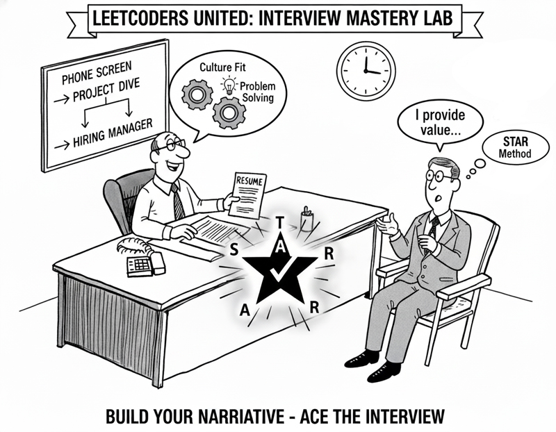

# ~A Short Interview Guide (Resume-Focused)~
by LeetCoders United

**Session Overview:** This guide is the script for our practice session. Our goal is to practice using a resume as the central tool to communicate value, skills, and cultural fit for a new role. This practice is a critical step in the interview preparation process because these questions may appear at *every* stage of the interview process - from the phone screen with the recruiter to a project dive in a technical or behavioural round to the final interview with the hiring manager and/or CTO.
### Part 1: The Opener (The 60-90 Second Pitch)
* **Example Questions:**
  * "Tell me about yourself."
  * "Why should we hire you?"
  * "Can you give me the 2-minute overview of your background?"
* **Interviewer's Intention:**
  * To assess your confidence, preparedness, and communication skills (the "60-Second Rule").
  * To hear your **"clear value proposition"** and if you've aligned your top 3 strengths with the job description.
  * To see if you're a good "Culture Fit" from the very beginning.
* **Candidate's Goal & Tips:**
  * **Structure:** Use the "Rule of Three." Start with your current role, highlight 1-2 key achievements from your resume, and connect it all to *why* you are a great fit for *this* role.
  * **Alignment:** This is your chance to show "Skill and Company Alignment." Explicitly connect your skills to the company's values (e.g., "I saw your company values 'customer obsession,' and in my last role...").
  * **For New Candidates:** If you have less experience, still use your full 60-90 seconds. Talk about your "spark" (what got you into the field), your education, and 1-2 key academic projects or internships. Treat them like real-world experience.

⠀Part 2: The Chronology ("Walk Me Through Your Resume")
* **Example Questions:**
  * "Can you walk me through your resume, starting from [X position]?"
  * "I have your resume, but I'd love for you to tell me your career story."
* **Interviewer's Intention:**
  * To understand the *narrative* of your career: Why did you make these moves?
  * To listen for your **"positivity."** How do you talk about past jobs, managers, and teams? Are you respectful and focused on growth?
  * To see if you are a **"continual learner"** by how you frame your progression.
* **Candidate's Goal & Tips:**
  * **Be Strategic:** Don't treat all roles equally. Spend 10 seconds on your first, less-relevant job and 60 seconds on your last, highly-relevant one.
  * **Frame Everything Positively:** This is new.
    * **Don't say:** "I left that job because my manager was terrible."
    * **Do say:** "After two years, I had learned a lot and was ready for a new challenge, specifically in [New Skill], which led me to my next role."

⠀Part 3: The Deep Dive (Project & Behavioral)
* **Example Questions:**
  * **Technical:** "I see you worked on [Project X]. What was the biggest technical challenge you *personally* faced?"
  * **Teamwork:** "What would your co-workers on that project say about you?"
  * **Management:** "What was the management style like on that team? How do you like to be managed?"
  * **Problem-Solving:** "Tell me about a time on this project you had a disagreement with a stakeholder."
  * **Proactivity:** "Tell me about a time you 'proactively stepped up' during this project."
* **Interviewer's Intention:**
  * To separate what "we" (the team) did from what "I" (the candidate) *personally* did.
  * To test for **"self-awareness,"** **"coachability,"** and **"soft edges."**
  * To see if you pivot to **"what you learned"** when discussing failures or conflict.
* **Candidate's Goal & Tips:**
  * **Use the STAR Method:** This is critical for all behavioral questions (conflict, failure, proactivity).
    * **S**ituation: "We had a tight deadline for [Project X]..."
    * **T**ask: "My task was to design and implement the API..."
    * **A**ction: "**I** personally designed the new endpoints, wrote the documentation, and mentored a junior dev..." (Use "I," not "we").
    * **R**esult: "As a result, we launched on time and reduced API latency by 30%."
  * **Prepare for "Fit":** Your answers to "how you like to be managed" and "what co-workers say" are direct tests of "Culture Fit." Be honest and frame it around collaboration and initiative.
